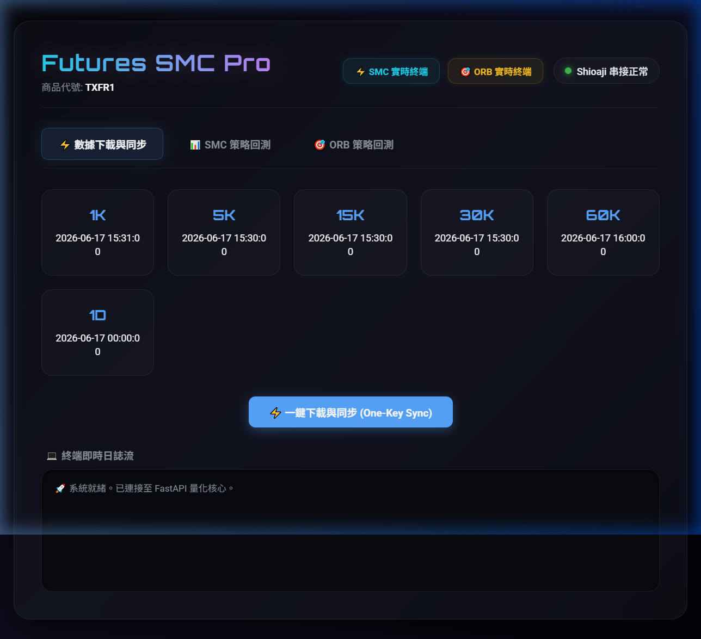
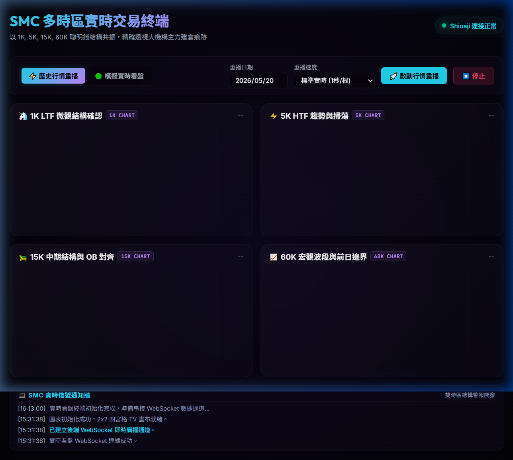
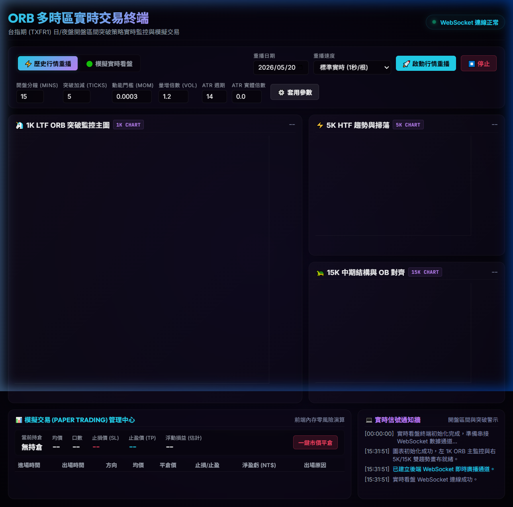

# 台指期自動化量化交易系統 - 使用與操作手冊

本手冊旨在為交易員與量化研究員提供 **SMC (Smart Money Concept) 雙時區策略** 與 **ORB (Opening Range Breakout) 開盤突破策略** 實時交易系統的操作指南。系統採用 Cyberpunk 科技感風格面盤，提供高勝率、一站式的量化回測與模擬交易體驗。

---

## 🌟 系統三大核心入口

在系統的主控制面板中，頂部 Header 右側已整合了實時終端入口，可以一鍵另開新分頁以確保 WebSocket 實時數據流連線的穩定性：
- ⚡ **SMC 實時終端**（藍色霓虹按鈕）
- 🎯 **ORB 實時終端**（金色霓虹按鈕）

---

## 📊 1. 系統主控制面板 (Dashboard)

主控制面板為系統的決策與回測中樞。在此您可以設定策略參數、載入歷史 K 線、執行單次策略回測或進行多進程參數最佳化。

### 💻 系統畫面展示

### ⚙️ 核心操作指引
1. **Shioaji 與系統狀態檢查**：
   - 頂部 Header 右側會即時顯示「Shioaji 串接狀態」。綠色代表與永豐金 API 連線正常，紅色代表斷線或尚未載入憑證。
2. **參數配置區**：
   - **時間區間與合約**：選擇回測的起始/結束日期，並填入標的合約代碼（例如：`TXFR1` 代表台指期近月連續合約）。
   - **SMC 參數設定**：可自由調整大小週期組合（如大週期 5K + 小週期 1K）、Unicorn 策略的 OB 破壞塊寬度限制、FVG 點數要求等。
   - **ORB 參數設定**：調整開盤收集分鐘（預設 15 分鐘）、突破緩衝點數（Ticks）、賺賠比（R-R）、以及進階 ATR 實體強度過濾器。
3. **回測執行**：
   - 點擊「開始 SMC 策略回測」或「開始 ORB 策略回測」，系統將在背景拉取 SQLite 數據庫資料並在毫秒級內計算完成。
   - 回測完成後，下方會動態生成「累積損益圖表」、「資金淨值曲線」，以及詳細的「交易明細歷史日誌表」。
4. **多進程參數優化掃描**：
   - 點擊「多進程最佳化 (ORB)」或「SMC 網格最佳化」，系統將使用 `ProcessPoolExecutor` 多核心並行計算，快速尋找獲利因子與勝率最高的「參數高原」，並輸出優化報告。

---

## 🦄 2. SMC MTF 實時交易看盤終端 (SMC MTF Live Trading Terminal)

SMC 實時看盤終端採用了 TradingView 的 `lightweight-charts` 技術，實作了 **1K、5K、15K、60K** 的雙時區 (MTF) 四宮格即時生長畫布。

### 💻 系統畫面展示

### ⚡ 核心功能與特色
- **WebSocket 實時數據流**：透過 `asyncio.Queue` 將 Shioaji 逐筆 Tick 數據實時聚合，並即時廣播到前端四宮格。
- **無未來偏差大週期標記**：
  - 5K、15K、60K 的訂單塊 (OB) 與失衡區 (FVG) 會在**K棒收盤確認**後，才對齊至 1K 圖表上，徹底消除在回測或看盤時「偷看大週期未來價格」的盲點。
- **SMC 結構標記與警示牆**：
  - 圖表上會即時標註 **CHoCH**（結構轉變虛線）、**OB**（訂單塊水平帶）與 **Sweep**（流動性獵取標記）。
  - 右側警報牆會即時推送最新的結構變化，輔助交易員決定最佳的左側/右側進場點。
- **台北時區防護**：
  - 系統在前端與後端皆加入了台北時區 (`Asia/Taipei`) 強制格式化防護，避免因瀏覽器所在地區不同導致 K 線時間軸出現平移偏移。

---

## 🎯 3. ORB 多時區實時交易終端 (ORB Real-time Trading Terminal)

ORB 實時終端採用專為開盤突破策略設計的 **60/40 比例科技感版面**：左側 60% 為 1K 主監控圖表；右側 40% 為 5K 與 15K 的大趨勢對照圖。

### 💻 系統畫面展示

### 📈 開盤突破與模擬交易流程
1. **開盤收集區間動態畫線**：
   - 每日開盤（日盤 08:45-09:00，夜盤 15:00-15:15）期間，左側圖表右上角會顯示「區間確立倒數（秒）」，並以半透明虛線動態描繪當前高低點。
   - 區間確立後，虛線自動變更為**霓虹實線**（青色為上界軌道，粉色為下界軌道）。
2. **十字游標同步分析**：
   - 移動左側 1K 圖表的十字游標時，右側 5K 與 15K 的圖表游標將會**100% 同步連動**，大幅提升多時區趨勢判讀效率。
3. **零風險前端模擬交易 (Paper Trading)**：
   - 當價格實時突破軌道時，系統會自動彈出「開盤突破警示對話框」，展示突破方向、建議進場價、止損（K 棒極值）與 2.0 倍盈虧比止盈價。
   - 點擊「確認進場」後，1K 主圖表上將會動態生成三條策略引導線：
     - **灰色 Entry 線**：進場基準價。
     - **紅色 SL 線**：止損防禦線。
     - **綠色 TP 線**：止盈目標線。
   - 持倉期間，右上角會以 60 FPS 動態更新目前的「持倉點數損益」與「金額損益」（小台指每點 NT$ 50）。
   - 當價格觸及 SL / TP，或者交易時段結束（日盤 13:45，夜盤 05:00）時，系統將**自動強制平倉**，並在下方「歷史交易日誌」中插入一筆精準的平倉紀錄與平倉原因。

---

## 🛡️ 4. 關鍵優化機制與風控說明

為了在多震盪的台指期市場中穩定獲利，本系統內建了三項極為關鍵的風控與優化參數：

> [!IMPORTANT]
> **1. range_edge 假突破即停損防禦**
> - **機制**：傳統 ORB 停損多設在對側軌道，但在波動劇烈時可能導致極大虧損。本系統實作了「假突破即停損」策略：
>   - **多單**：價格回頭跌破「上軌減去緩衝點數（緩衝一般設為 0）」即刻停損。
>   - **空單**：價格回頭突破「下軌加上緩衝點數」即刻停損。
>   - **保護機制**：搭配 `min_sl_points`（如 5-15 點）防止突破 K 棒太小導致被雜訊秒洗出場。
> - **回測成效**：此項機制使 ORB 策略的勝率提升 **6.83%**，整體淨損益成長了 **4.3 倍**！

> [!TIP]
> **2. ATR 實體強度過濾器 (ATR Body Filter)**
> - **機制**：當 `orb_atr_multiplier` 大於 0 時啟用。要求突破開盤軌道的那根 K 棒，其「實體高度（`|Close - Open|`）」必須大於前 14 根 K 棒的平均真實波幅 (ATR) 乘以該倍數。
> - **目的**：有效篩選掉無力爬行、沒有爆發量能的「假突破」，避免震盪盤洗盤。

> [!NOTE]
> **3. 保底 1 口交易機制 (Min 1 Lot Fallback)**
> - **機制**：當啟動 `force_min_lot` 且帳戶總資金足夠支付最低保證金（小台指 50,000 元，大台指 200,000 元）時，若因風控比例（例如單筆只冒險 1% 資金）計算出的交易口數不足 1 口（被捨去為 0），系統會強制以 **1 口** 進場。
> - **目的**：避免小資金帳戶在回測與實盤中，因為風控公式捨去而漏接所有關鍵突破訊號。

---

本手冊由 AI Technical Co-Founder 自動生成，若您需要調整任何策略參數或了解背後的代碼實作細節，請隨時於對話中提出！
