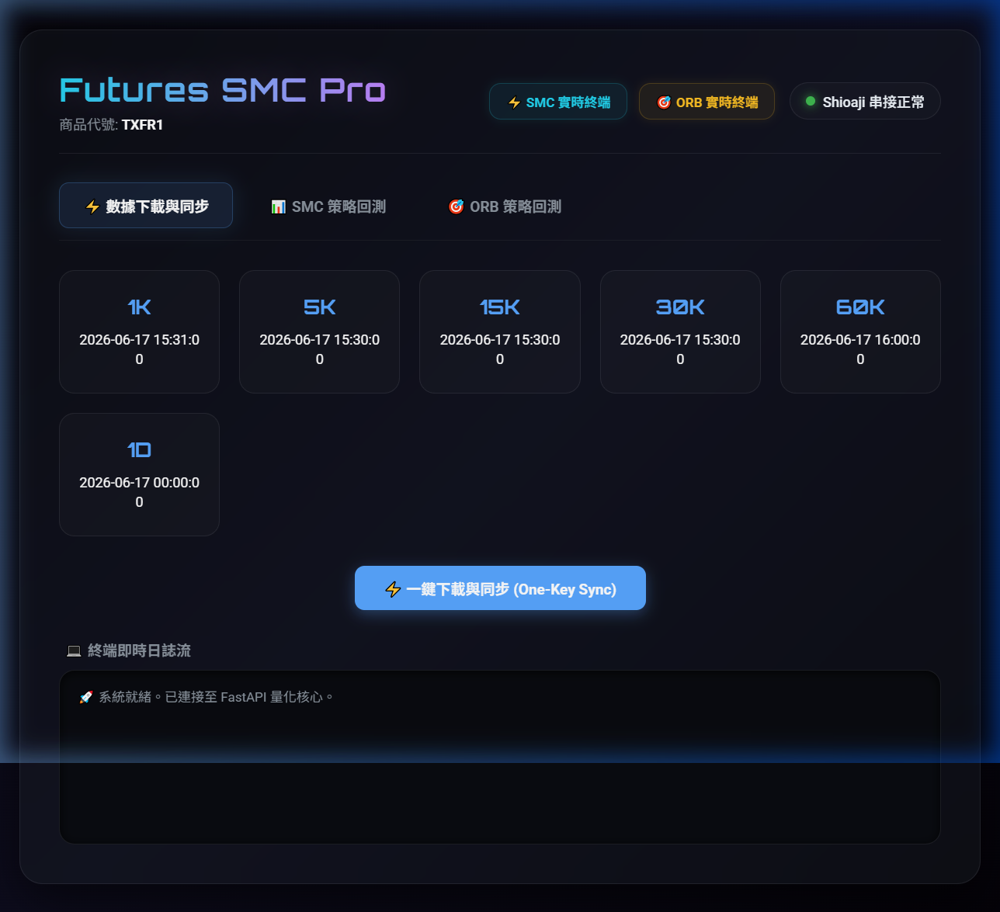
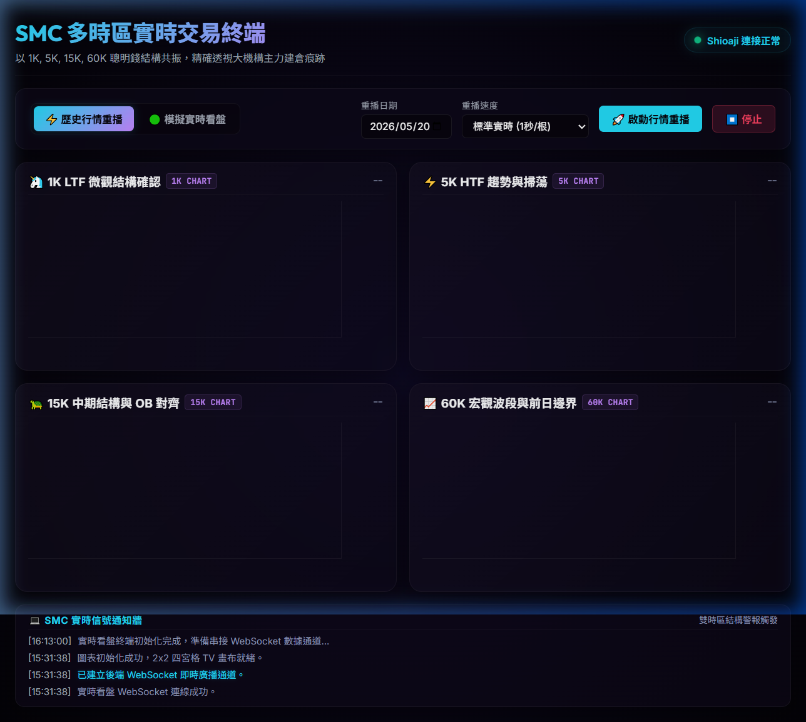
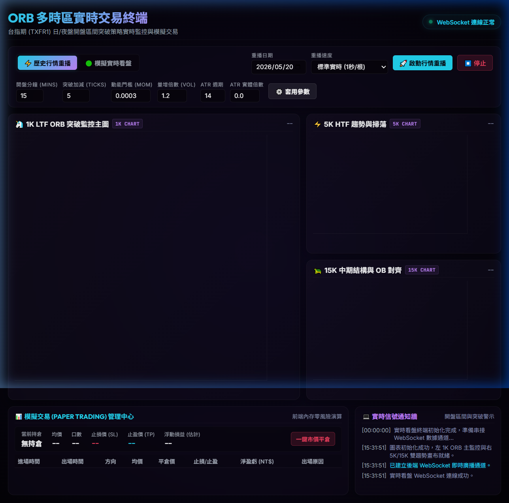

# 台指期自動化量化交易系統 - 使用與操作手冊

本手冊旨在為交易員與量化研究員提供 **SMC (Smart Money Concept) 雙時區策略** 與 **ORB (Opening Range Breakout) 開盤突破策略** 實時交易與量化回測系統的操作指南。系統採用 Cyberpunk 科技感風格面盤，提供高勝率、一站式的量化回測與模擬交易體驗。

---

## 🌟 系統三大核心入口

在系統的主控制面板中，頂部 Header 右側已整合了實時終端入口，可以一鍵另開新分頁以確保 WebSocket 實時數據流連線的穩定性：
- ⚡ **SMC 實時終端**（藍色霓虹按鈕，對應 `/live`）
- 🎯 **ORB 實時終端**（金色霓虹按鈕，對應 `/orb_terminal`）

---

## 📊 1. 系統主控制面板 (Dashboard) 與基本操作

主控制面板為整個交易系統的決策與回測中樞。在此您可以設定策略參數、載入歷史 K 線、執行單次策略回測或進行多進程參數最佳化。

### 💻 系統畫面展示


### ⚙️ 核心操作指引
1. **Shioaji 與系統狀態檢查**：
   - 頂部 Header 右側會即時顯示「Shioaji 串接狀態」。綠色代表與永豐金 API 連線正常，紅色代表斷線或尚未載入憑證。
2. **參數配置區**：
   - **時間區間與合約**：選擇回測的起始/結束日期，並填入標的合約代碼（例如：`TXFR1` 代表台指期近月連續合約，`MTX` 代表小台指，`TX` 代表大台指）。
   - **SMC 參數設定**：可自由調整大小週期組合（如大週期 5K + 小週期 1K）、Unicorn 策略的 OB 破壞塊寬度限制、FVG 點數要求等。
   - **ORB 參數設定**：調整開盤收集分鐘（預設 15 分鐘）、突破緩衝點數（Ticks）、賺賠比（R-R）、以及進階 ATR 實體強度過濾器。
3. **回測執行**：
   - 點擊「開始 SMC 策略回測」或「開始 ORB 策略回測」，系統將在背景拉取 SQLite 數據庫資料並在毫秒級內計算完成。
   - 回測完成後，下方會動態生成「累積損益圖表」、「資金淨值曲線」，以及詳細的「交易明細歷史日誌表」。
4. **多進程參數優化庫掃描**：
   - 點擊「多進程最佳化 (ORB)」或「SMC 網格最佳化」，系統將使用 `ProcessPoolExecutor` 多核心並行計算，快速尋找獲利因子與勝率最高的「參數高原」，並輸出優化報告。

---

## 🦄 2. SMC MTF 實時交易看盤終端 (SMC MTF Live Trading Terminal)

SMC 實時看盤終端採用了 TradingView 的 `lightweight-charts` 技術，實作了 **1K、5K、15K、60K** 的雙時區 (MTF) 四宮格即時生長畫布。

### 💻 系統畫面展示


### ⚡ 核心功能與特色
- **WebSocket 實時數據流**：透過 `asyncio.Queue` 將 Shioaji 逐筆 Tick 數據實時聚合，並即時廣播到前端四宮格。
- **SMC 結構標記與警示牆**：
  - 圖表上會即時標註 **CHoCH**（結構轉變虛線）、**OB**（訂單塊水平帶）與 **Sweep**（流動性獵取標記）。
  - 右側警報牆會即時推送最新的結構變化，輔助交易員決定最佳的左側/右側進場點。
- **台北時區防護**：
  - 系統在前端與後端皆加入了台北時區 (`Asia/Taipei`) 強制格式化防護，避免因瀏覽器所在地區不同導致 K 線時間軸出現平移偏移。

---

## 🎯 3. ORB 多時區實時交易終端 (ORB Real-time Trading Terminal)

ORB 實時終端採用專為開盤突破策略設計的 **60/40 比例科技感版面**：左側 60% 為 1K 主監控圖表；右側 40% 為 5K 與 15K 的大趨勢對照圖。

### 💻 系統畫面展示


### 📈 開盤突破與模擬交易流程
1. **開盤收集區間動態畫線**：
   - 每日開盤（日盤 08:45-09:00，夜盤 15:00-15:15）期間，左側圖表右上角會顯示「區間確立倒數（秒）」，並以半透明虛線動態描繪當前高低點。
   - 區間確立後，虛線自動變更為**霓虹實線**（青色為上界軌道，粉色為下界軌道）。
2. **十字游標同步分析**：
   - 移動左側 1K 圖表的十字游標時，右側 5K 與 15K 的圖表游標將會**100% 同步連動**，大幅提升多時區趨勢判讀效率。
3. **零風險前端模擬交易 (Paper Trading)**：
   - 當價格實時突破軌道時，系統會自動彈出「開盤突破警示對話框」，展示突破方向、建議進場價、止損（K 棒極值）與 2.0 倍盈虧比止盈價。
   - 點擊「確認進場」後，1K 主圖表上將會動態生成三條策略引導線：灰色 Entry 線、紅色 SL 線、綠色 TP 線。
   - 持倉期間，右上角會以 60 FPS 動態更新目前的「持倉點數損益」與「金額損益」（小台指每點 NT$ 50）。
   - 當價格觸及 SL / TP，或者交易時段結束（日盤 13:45，夜盤 05:00）時，系統將**自動強制平倉**。

---

## 📈 4. SMC 雙時區策略量化回測深度指南

Smart Money Concept (SMC) 策略是基於市場微觀結構（訂單流、流動性獵取與市場結構轉變）進行設計。本系統的核心優勢在於**雙時區 (MTF) 的無look-ahead-bias回測**。

### 4.1 無未來偏差 (Look-Ahead Bias) 對齊機制
在大週期與小週期（例如 5K 大週期與 1K 小週期）的混合回測中，最容易發生的邏輯錯誤是在 1K 的 09:01:00 偷看了 5K 在 09:05:00 才收盤的 K 棒數據，導致回測勝率異常偏高。
本系統使用 **Pandas 移位 (Shift) 與 `pd.merge_asof`** 來徹底消除此舞弊：

```
【5K 大週期時間軸】
[08:50 - 08:55] 已收盤 確認 ───► 時間戳平移 5 分鐘 ───► 變為 09:00:00 訊號可用
[08:55 - 09:00] 已收盤 確認 ───► 時間戳平移 5 分鐘 ───► 變為 09:05:00 訊號可用

【1K 小週期時間軸與 Asof 對齊】
09:01:00 (1K) ───► pd.merge_asof(direction='backward') ───► 只能配對到 <= 09:01:00 的 5K 資訊
                                                             (即配對到 09:00:00 可用的 08:55 收盤資訊)
09:04:00 (1K) ───► pd.merge_asof(direction='backward') ───► 依然配對到 09:00:00 可用的 08:55 資訊
09:05:00 (1K) ───► pd.merge_asof(direction='backward') ───► 此時才可以開始配對 09:05:00 可用的 09:00 資訊
```
- **代碼實作**：
  ```python
  df_5k_shifted = df_5k.copy()
  df_5k_shifted['datetime'] = df_5k_shifted['datetime'] + timedelta(minutes=5)  # 強制平移至收盤時間
  
  merged_df = pd.merge_asof(
      df_1k.sort_values('datetime'),
      df_5k_shifted.sort_values('datetime'),
      on='datetime',
      direction='backward'  # 僅配對過去已收盤的最新 5K 資料
  )
  ```

### 4.2 🦄 Unicorn Model (台指獨角獸) 策略邏輯
- **核心邏輯**：大週期（5K）尋找關鍵流動性獵取（Sweep），小週期（1K）尋找結構轉變（CHoCH），並在 1K 的訂單塊（OB）與失衡區（FVG）重疊處（即共振區）進場。
- **進場流程**：
  1. **獵取 Setup**：5K 出現 `htf_sweep_low`（多頭）或 `htf_sweep_high`（空頭）。此 Setup 啟動後，在接下來 **30 分鐘內**為有效交易窗口。
  2. **CHoCH 確認**：在 30 分鐘窗口內， 1K 出現 `ltf_choch_bullish`（多頭）或 `ltf_choch_bearish`（空頭）結構突破。
  3. **極限進場與風控**：
     - **做多**：進場掛單於 5K 訂單塊上沿 `setup_ob_top`。停損設於大週期 OB 下沿再減 5 點（或保底 20 點防禦）：
       $$\text{Risk Points} = \max(\text{min\_sl}, \text{OB\_Top} - \text{OB\_Bottom} + 5)$$
       $$\text{Stop Loss} = \text{Entry Price} - \text{Risk Points}$$
     - **口數計算**：依據單筆最大冒險資金比率（如 1%）：
       $$\text{Lots} = \lfloor \frac{\text{Capital} \times \text{Risk Pct}}{\text{Risk Points} \times \text{Point Value}} \rfloor$$
  4. **止盈 (TP) 模式**：
     - `rr` (預設)：固定賺賠比（如 Entry + 2.0 × Risk Points）。
     - `opposite_swing`：對側波段高低點（5K 前一個高點/低點）。
     - `opposite_ob`：對側大週期 OB 邊緣。

### 4.3 ⚡ Silver Bullet (台指銀色子彈) 專業最佳化策略邏輯 [NEW ARCHITECTURE]
本系統對經典 ICT 銀色子彈策略進行了機構級工程化升級與風控重構，核心邏輯模組封裝於 `app/strategy/silver_bullet.py`：

1. **美國夏/冬令時自適應 Killzone (US DST Adaptive Killzone)**：
   - **日盤黃金時段**：固定 **09:00 - 10:00**（台股現貨主力開盤爆發段）。
   - **夜盤黃金時段**：透過 `USDaylightSavingDetector` 自動根據日期辨識美股日光節約時間：
     - **夏令時間 (EDT)**：**21:30 - 22:30**
     - **冬令時間 (EST)**：**22:30 - 23:30**
2. **多維度過濾管道 (SMCFilterPipeline)**：
   - **VWAP 籌碼趨勢過濾 (`SMCVWAPFilter`)**：做多突破棒價格必須大於當日累積成交量加權均價（$\text{Close} \ge \text{VWAP}$）；做空必須低於當日均價（$\text{Close} \le \text{VWAP}$），保證大資金順勢方向。
   - **成交量突波過濾 (`SMCVolumeSpikeFilter`)**：形成 FVG 之位移 K 棒成交量必須達到過去 20 根均量的指定倍數（預設 1.3 倍），排除無量假跳空。
3. **50% CE 限價單回測撮合模型 (Limit Retest Fill)**：
   - 當 1K FVG 成立收盤時，系統不在收盤市價追高，而是在 FVG 缺口中軸（50% Consequent Encroachment, CE）掛出限價單：
     $$\text{Limit Entry} = \frac{\text{FVG\_Top} + \text{FVG\_Bottom}}{2}$$
   - **回測等待時效**：設定 `max_wait_bars=5`，若在 5 根 1K 棒內回踩觸及該價位則撮合成交；若逾期未回踩或脫離 Killzone 則自動撤單。
4. **結構極值防守 (Structural Swing Extreme Stop Loss)**：
   - 停損設於觸發本次流動性獵取的 Sweep 波段極值（波段最高點/最低點）外加 3 點緩衝（附帶保底 15 點）：
     $$\text{Stop Loss (Long)} = \min(\text{Low}_{\text{sweep\_window}}) - 3.0$$
   - 大幅減少遭隨機微型雜訊洗盤掃損的頻率。
5. **1R 動態移保本機制 (1.0R Breakeven Trigger)**：
   - 當持倉浮盈達到 $1.0\text{R}$（即獲利點數達原始承擔風險點數）時，系統自動將止損價提升至進場成本價：
     $$\text{Trigger Condition: } \text{Unrealized PnL} \ge 1.0 \times \text{Risk Points} \implies \text{Stop Loss} \leftarrow \text{Entry Price}$$
   - 有效防止原本大幅獲利的單子因行情回頭演變成全額虧損，顯著壓平資金回撤曲線。
6. **專屬工程化腳本工具鏈**：
   - `scripts/backtest/test_silver_bullet.py`：包含夏冬令時、過濾管道、50% CE 回測撮合與 1R 保本之完整單元測試。
   - `scripts/backtest/run_silver_bullet_comparison.py`：新舊版本在真實 SQLite 數據上的全維度對比回測與 HTML 資金曲線走勢報告。
   - `scripts/backtest/optimize_silver_bullet.py`：多進程平行網格參數搜尋優化器，自動搜尋最優量能門檻、掛單層級與風控組合。

---

## ⚡ 5. ORB 開盤突破策略量化回測與風控優化指南

開盤區間突破 (Opening Range Breakout, ORB) 是一種經典的動能策略，核心在於捕捉開盤初期的波動，並於價格突破該區間高低限時順勢進場。

### 5.1 ORB 突破與量能/動能過濾
1. **區間計算**：設定收集時間（預設 15 分鐘，即日盤 08:45 - 09:00）。在此區間內記錄最高價（$H_{orb}$）與最低價（$L_{orb}$）。
2. **突破觸發**：當價格超過 $H_{orb} + \text{Breakout Ticks}$ 則做多；低於 $L_{orb} - \text{Breakout Ticks}$ 則做空。
3. **雙重過濾防震盪**：
   - **動能門檻**：突破 K 棒的實體變化率（$\frac{|Close - Open|}{Open}$）必須大於 `momentum_threshold`，防範緩慢爬行。
   - **量增比率**：突破當下的 1K 成交量必須大於前 5 根 K 棒平均成交量的 `vol_spike_ratio`（如 1.5 倍），以成交量證實突破的真實性。

### 5.2 四大停損模式 (SL Mode) 深度對照與實測
策略的停損機制決定了最終的獲利天花板。本系統提供四大模式：

| 停損模式 (`sl_mode`) | 停損計算公式 (以多單為例) | 優點 | 缺點 | 實測損益 (點) (小台指 5/1-6/1) |
| :--- | :--- | :--- | :--- | :--- |
| **1. `bar_extreme` (突破 K 棒極值)** | $StopLoss = \text{突破 K 棒最低點} - \text{Ticks}$ | 符合動能突破邏輯，停損點明確。 | 當突破 K 棒過長時，停損距離過大。 | **-4,420 點** |
| **2. `range_edge` (軌道同側假突破) [NEW]** | $StopLoss = \text{開盤區間上限} - \text{緩衝點數}$ | 停損空間極小，一旦突破失敗縮回區間即刻離場。 | 在震盪盤中容易被反覆掃損。 | **+78,892.0 點** (獲利翻 4.3 倍) |
| **3. `atr_dynamic` (ATR 動態)** | $StopLoss = \text{進場價} - \text{ATR} \times \text{Multiplier}$ | 根據市場波動率動態調整，波動大時停損寬，波動小時停損窄。 | 參數設定較敏感，需定期校正。 | **+76,818 點** |
| **4. `fixed_points` (固定點數)** | $StopLoss = \text{進場價} - \text{Fixed Points}$ | 計算簡單，最大虧損金額完全固定。 | 忽略市場波動環境的改變。 | **+81,992 點** |

> [!IMPORTANT]
> **軌道同側停損 (`range_edge`) 的優化成效說明**
> 經多進程優化器實測，在 2026 年 5 月的台指期數據中：
> - 傳統的 `bar_extreme` 停損因為回頭空間大，遭遇洗盤時單筆損失點數過高，導致淨損益為 **-4,420 點**。
> - 改用 `range_edge`（搭配保底 `min_sl_points=20.0` 點保護）後，因為多單一旦跌回上軌就視為假突破立即出場，大幅縮減了無效虧損空間。**勝率從 35.90% 提升至 47.37%，淨損益爆發性成長為 +78,892.0 點**！

### 5.3 ATR 實體強度過濾與保底 1 口交易
- **ATR 實體強度過濾器 (ATR Body Filter)**：
  在價格超越開盤軌道時，系統會計算當前 1K 的實體高度（`|Close - Open|`），要求其必須大於或等於前 14 根 K 棒平均 ATR 的指定倍數（如 1.5 倍）。這能直接過濾掉「慢速無力爬行」的假突破。
- **保底 1 口交易機制 (Min 1 Lot Fallback)**：
  小資金交易帳戶（例如 10 萬元）在 1% 風控下，若遇上停損距離較遠（如 60 點）的訊號，算出的口數常因為小於 1 口而被 `int()` 無條件捨去為 0。本系統提供 `force_min_lot` 開關：當總資金大於交易所最低保證金（小台 50,000 元）時，強制以 **1 口** 進場，確保不漏接任何一次翻倍的突破行情。

### 5.4 Web 回測操作與多進程優化排行
- **操作步驟**：
  1. 在 Dashboard 點擊 **ORB 策略回測** 頁籤。
  2. 設定收集分鐘數、突破 Ticks 數、動能與量能比率。
  3. 下拉選擇 **停損計算模式**（建議選擇 `range_edge`），並設定最低保護點數與固定停損點數。
  4. 點擊「執行回測」查看淨值曲線，或點擊「參數最佳化」啟動多進程掃描。
- **優化器排序演算法**：
  並行計算完成後，系統會過濾掉總交易次數小於 15 次的參數組（防範過度擬合的極端孤立參數），並嚴格按照 **勝率 (Win Rate) ➜ 獲利因子 (Profit Factor) ➜ 淨損益 (Net P&L)** 的多重指標優先權排序，將前 10 名參數呈現在排行榜表格中。

---

## 🎯 6. SMC 流動性獵取假突破反轉策略 (Sweep Fade / Turtle Soup)

在 2026 年台指期（加權指數 22,000 ~ 24,000 點高波動區間）中，市場莊家與高頻造市商頻繁利用散戶追價心理，在關鍵流動性極值發動「假突破獵殺 (Liquidity Hunt)」。單純的順勢突破常淪為接刀，而 **SMC Sweep Fade 策略** 正是反向利用此市場微觀結構的頂級阿爾法策略。

### 6.1 核心獵取目標池 (Liquidity Pools)
1. **前日高低點 (PDH / PDL)**：外資與法人最關注的跨日關鍵支撐阻力位。
2. **開盤 15 分鐘極值 (ORB 15m High / Low)**：08:45-09:00 日盤開盤第一波確立的流動性磁鐵。

### 6.2 精準進場與拒絕影線 (Rejection Wick Trigger)
- **刺穿深度過濾 (Penetration Filter)**：價格突破池位必須在 **3.0 ~ 35.0 點** 之間。刺穿 > 35 點直接視為強單邊真突破，嚴禁逆勢接刀。
- **影線拒絕強度**：K 棒收盤跌回池內（做空）或漲回池內（做多），拒絕影線佔比 $\ge 40\%$ 且影線長度大於或等於 K 棒實體。

### 6.3 二段階梯停利與動態保本 (Two-Stage Take Profit)
- **停損防守**：設於 Sweep 影線極值 +3 點（因 2026 年台指 1K 平均波動達 25 點，設保底 `min_sl_points=30.0` 點防隨機跳動掃損）。
- **TP1 (鎖定 50% 倉位 + 移動保本)**：價格回歸當盤 **VWAP 均價線**，即刻平倉 50% 口數，並**立即將停損移至進場成本價 (Breakeven)**，立於不敗之地。
- **TP2 (波段奔馳)**：剩餘 50% 倉位瞄準對側流動性池或維持奔馳至收盤，捕獲大波段反轉暴利。

### 6.4 黃金交易時段 (Golden Windows)
經大數據小時級別熱力圖分析，台指假突破反轉具備顯著的時間集中性：
- ❌ **有毒時段 (禁止交易)**：09:00-10:00 (台股現貨剛開盤機構暴力單邊衝擊)、16:00-19:00 (晚餐無量洗盤)、00:00-03:30 (美股中場停滯)。
- ✅ **黃金時段 (`allowed_hours=[10, 11, 15, 19, 20, 21, 4]`)**：
  - **10:00 - 11:30**：日盤現貨衝擊後機構動能竭盡，均值回歸強烈。
  - **15:00 - 16:00**：夜盤開盤誘多/誘空假突破獵殺。
  - **19:00 - 21:30**：美股開盤前夕經濟數據公布前後的流動性清掃。
  - **04:00 - 05:00**：美股尾盤結算衰竭反轉。

### 6.5 2026 全年 (2026-01-01 ~ 2026-09-16) 實戰回測戰績

#### 📈 小台指 (MTX, NT$ 50/點)
- **總交易結算次數**：256 筆 (平均每 1.5 天進場 1 次)
- **獲利因子 (Profit Factor)**：**1.44**
- **勝率**：**37.89%**
- **盈虧比 (Avg Win / Avg Loss)**：**2.35 : 1** (平均獲利 NT$ 29,521 vs 平均虧損 NT$ -12,536)
- **最大回撤 (Max Drawdown)**：**22.46%**
- **淨損益 (Net Profit)**：**+NT$ 870,274** (總報酬率 **+87.03%**)

#### 🚀 大台指 (TX, NT$ 200/點)
- **獲利因子 (Profit Factor)**：**1.61**
- **最大回撤 (Max Drawdown)**：**23.20%**
- **淨損益 (Net Profit)**：**+NT$ 1,592,726** (總報酬率 **+159.27%**)

---

## 🛡️ 7. 量化交易與系統風控守則

1. **嚴格單筆冒險資金限制**：建議將單筆風險比率 (`risk_pct`) 設在 **0.5% ~ 1.0%** 之間，防範台指期跳空洗盤時造成的權益嚴重回撤。
2. **手續費與滑價磨擦**：回測中已嚴格計入小台 40 元、大台 100 元的固定雙邊成本及 0.002% 期交稅。
3. **時段平倉防跳空**：所有當沖策略於日盤 13:45 及夜盤 05:00 執行強制收盤平倉，**嚴禁留倉過夜**，杜絕跳空開盤風險。

---

本手冊由 AI Technical Co-Founder 自動生成，若您需要調整策略參數或進行實盤接單串接，請隨時於對話中提出！

