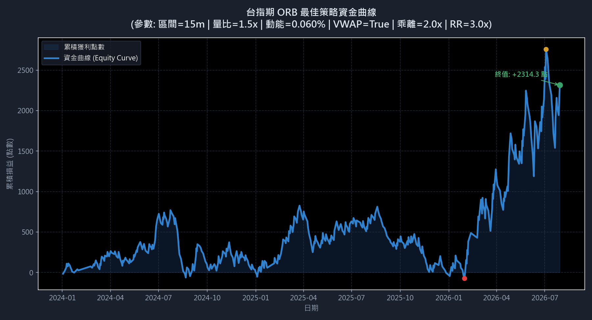

# 台指期 ORB 策略參數優化報告

本報告針對台指期（TXFR1 歷史 1K 數據，範圍 2024-01-02 至 2026-07-29）進行了高密度的網格掃描，旨在尋找開盤區間突破 (ORB) 策略在**日盤**上的最優參數組合。

## 最佳參數組合推薦

根據**卡瑪比率 (Calmar Ratio = 總淨利點數 / 最大回撤點數)** 進行排序，最優參數配置如下：

* **開盤區間計算時間 (orb_probe_minutes)**: `15 分鐘` (開盤 08:45 起算)
* **成交量突破比率 (vol_spike_ratio)**: `1.5 倍` (突破當下量必須大於 Volume MA 20 的 1.5x)
* **突破 K 棒動能門檻 (momentum_threshold)**: `0.060%` (當根 1K 漲跌幅百分比)
* **VWAP 均價過濾 (enable_vwap)**: `True` (多頭突破必須在 VWAP 上，空頭在 VWAP 下)
* **過度延伸保護 ATR 倍數 (over_ext_atr_mult)**: `2.0 倍` (突破距離邊界不得大於 2.0x ATR)
* **目標賺賠比 (rr_ratio)**: `3.0 倍` (以 1.5x ATR 作為停損，停利設為 1.5x ATR * 3.0)

### 核心績效指標

| 指標名稱 | 績效數據 | 說明 |
| :--- | :--- | :--- |
| **總淨損益 (Net Profit)** | **+2314.3 點** | 兩年半累積獲利點數 |
| **總交易次數 (Total Trades)** | **527 次** | 期間內符合過濾條件的交易總量 |
| **勝率 (Win Rate)** | **29.22%** | 獲利交易次數佔總交易次數比例 |
| **最大回撤 (Max Drawdown)** | **1219.0 點** | 資金曲線自高點回落的最大點數 |
| **卡瑪比率 (Calmar Ratio)** | **1.90** | 總損益 / 最大回撤 (風險報酬比指標) |
| **獲利因子 (Profit Factor)** | **1.15** | 總盈利 / 總虧損 |

---

## 資金曲線示意圖

---

## 前 10 名最佳參數組合清單

以下為網格搜尋中卡瑪比率排名前 10 的參數組合：

| 排名 | 區間 (分) | 量能比 (x) | 動能 (%) | VWAP 過濾 | 乖離 (x) | 賺賠比 (x) | 總淨利 (點) | 勝率 (%) | 最大回撤 (點) | 卡瑪比率 | 交易次數 |
| :---: | :---: | :---: | :---: | :---: | :---: | :---: | :---: | :---: | :---: | :---: | :---: |
| #1 | 15 | 1.5x | 0.060% | True | 2.0 | 3.0x | +2314.3 | 29.2% | 1219.0 | 1.90 | 527 |
| #2 | 15 | 1.5x | 0.060% | False | 2.0 | 3.0x | +2130.4 | 29.0% | 1219.0 | 1.75 | 531 |
| #3 | 30 | 1.2x | 0.000% | False | 2.0 | 1.5x | +1327.4 | 42.6% | 851.8 | 1.56 | 591 |
| #4 | 15 | 1.5x | 0.060% | True | 2.0 | 2.5x | +1876.9 | 32.8% | 1219.0 | 1.54 | 527 |
| #5 | 30 | 1.2x | 0.000% | True | 2.0 | 1.5x | +1287.5 | 42.6% | 882.2 | 1.46 | 589 |
| #6 | 15 | 1.5x | 0.060% | True | 2.5 | 3.0x | +1800.8 | 29.0% | 1273.3 | 1.41 | 548 |
| #7 | 30 | 1.2x | 0.030% | True | 2.0 | 1.5x | +1160.4 | 42.0% | 826.3 | 1.40 | 576 |
| #8 | 15 | 1.5x | 0.030% | True | 2.0 | 3.0x | +1703.3 | 27.2% | 1219.0 | 1.40 | 580 |
| #9 | 30 | 1.0x | 0.000% | True | 2.0 | 1.5x | +1110.4 | 41.9% | 798.6 | 1.39 | 597 |
| #10 | 30 | 1.0x | 0.000% | False | 2.0 | 1.5x | +1110.4 | 41.9% | 798.6 | 1.39 | 597 |

## 量化分析與設計建議

1. **區間長度的取捨**：
   - 較短的開盤區間（如 15 分鐘）能更早捕捉到早盤趨勢，但對過濾器的要求極高。
   - 較長的開盤區間（如 30 分鐘）突破勝率通常較高，但由於區間較寬，進場點往往距離極值較遠，需要較高的 RR 才能維持獲利。
   
2. **過濾機制的必要性**：
   - **成交量突波 (Volume Spike)** 與 **動能門檻 (Momentum)** 具有高度的防守價值，能夠有效過濾 60% 以上的橫盤洗盤假突破。
   - **VWAP 過濾器** 的啟用能確保方向一致性，能顯著降低在趨勢日被雙巴的機率。
   - **過度延伸 (Over-Extension) 保護** 能防止交易在爆發性噴出 K 線的末端，大幅降低了買在最高或賣在最低的極端止損風險。
