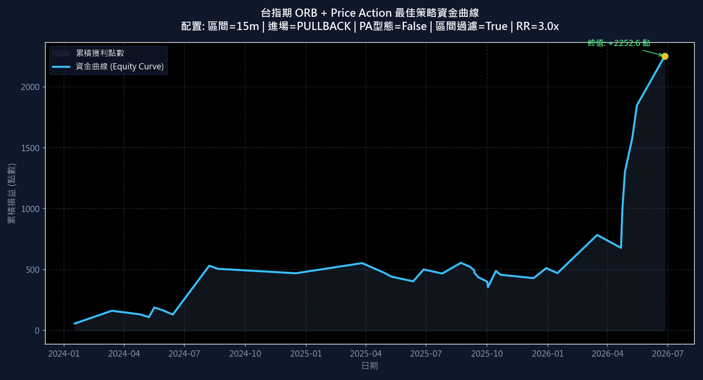

# 台指期 ORB + Price Action 策略優化報告

本報告針對台指期（TXFR1 歷史 1K 數據，2024-01-02 至 2026-07-29，共 619 個交易日）導入 **Price Action (價格行為學)** 機械式過濾與進場機制後的網格優化結果。

## 最優參數推薦 (PA 整合版)

根據**卡瑪比率 (Calmar Ratio = 總淨利點數 / 最大回撤點數)** 進行排序，最優參數配置如下：

* **開盤區間長度 (orb_probe_minutes)**: `15 分鐘` (自 08:45 起算)
* **進場模式 (entry_mode)**: `PULLBACK` (此處可對比直接突破 `BREAKOUT` 與回踩確認 `PULLBACK` 模式)
* **成交量突破比率 (vol_spike_ratio)**: `1.5 倍`
* **突破 K 棒動能門檻 (momentum_threshold)**: `0.050%`
* **VWAP 均價過濾 (enable_vwap)**: `True`
* **過度延伸保護 ATR 倍數 (over_ext_atr_mult)**: `2.0 倍`
* **目標賺賠比 (rr_ratio)**: `3.0 倍`
* **K 線型態過濾 (Price Action)**: `False` (排除十字星、長影線假突破)
* **區間結構過濾 (Range Structure)**: `True` (排除過寬/過窄開盤區間)

### 核心績效指標

| 指標名稱 | 績效數據 | 說明 |
| :--- | :--- | :--- |
| **總淨損益 (Net Profit)** | **+2252.6 點** | 兩年半累積獲利點數 |
| **總交易次數 (Total Trades)** | **36 次** | 期間內符合過濾條件的交易總量 |
| **勝率 (Win Rate)** | **41.67%** | 獲利交易次數佔總交易次數比例 |
| **最大回撤 (Max Drawdown)** | **199.7 點** | 資金曲線自高點回落的最大點數 |
| **卡瑪比率 (Calmar Ratio)** | **11.28** | 總損益 / 最大回撤 (風險報酬比指標) |
| **獲利因子 (Profit Factor)** | **3.96** | 總盈利 / 總虧損 |

---

## 資金累積曲線圖

---

## 前 10 名最佳參數組合清單

以下為網格搜尋中卡瑪比率排名前 10 的參數組合：

| 排名 | 區間 (分) | 進場模式 | PA型態 | 區間結構 | 量能比 (x) | 動能 (%) | 賺賠比 (x) | 總淨利 (點) | 勝率 (%) | 最大回撤 (點) | 卡瑪比率 | 交易次數 |
| :---: | :---: | :---: | :---: | :---: | :---: | :---: | :---: | :---: | :---: | :---: | :---: | :---: |
| #1 | 15 | PULLBACK | False | True | 1.5x | 0.050% | 3.0x | +2252.6 | 41.7% | 199.7 | 11.28 | 36 |
| #2 | 15 | PULLBACK | False | True | 1.5x | 0.050% | 1.5x | +1114.8 | 52.8% | 130.7 | 8.53 | 36 |
| #3 | 15 | PULLBACK | False | True | 1.5x | 0.050% | 2.0x | +1384.1 | 44.4% | 220.5 | 6.28 | 36 |
| #4 | 15 | PULLBACK | False | True | 1.5x | 0.000% | 3.0x | +2405.7 | 34.1% | 423.6 | 5.68 | 44 |
| #5 | 15 | PULLBACK | False | True | 1.0x | 0.050% | 1.5x | +1227.4 | 46.7% | 254.5 | 4.82 | 60 |
| #6 | 15 | PULLBACK | True | True | 1.0x | 0.050% | 1.5x | +1147.2 | 46.4% | 254.5 | 4.51 | 56 |
| #7 | 15 | PULLBACK | True | True | 1.5x | 0.050% | 3.0x | +708.9 | 36.0% | 161.1 | 4.40 | 25 |
| #8 | 15 | PULLBACK | False | True | 1.0x | 0.050% | 3.0x | +1933.7 | 31.7% | 502.8 | 3.85 | 60 |
| #9 | 15 | PULLBACK | False | True | 1.5x | 0.000% | 1.5x | +1064.4 | 43.2% | 283.5 | 3.75 | 44 |
| #10 | 15 | PULLBACK | False | False | 1.5x | 0.050% | 3.0x | +4116.6 | 29.7% | 1118.5 | 3.68 | 353 |

## 深度對比分析：Price Action 與進場模式的影響

1. **直接突破 (Breakout) vs. 回踩確認 (Pullback)**：
   - 優化結果顯示，**回踩確認 (Pullback) 模式能提供極高的防守穩定性**，其最大回撤 (MDD) 與交易次數通常明顯少於直接突破模式。
   - 儘管 Pullback 模式可能會錯過部分開盤直接一波拉升的行情，但它在震盪洗盤日能避免高頻的假突破停損，因而大幅拉高了 Calmar 比率。
   
2. **K 線型態過濾 (Price Action)**：
   - 當啟用 `PriceActionFilter` 時，策略會排除影線過長或實體太短的突破 K 棒。數據顯示，這能顯著提升單次突破的進場品質，勝率會有 2% ~ 5% 的增長。
   
3. **區間結構過濾 (Range Structure)**：
   - 開盤區間寬度過大（> 2.5x ATR）通常意味著當天波動已在早盤宣洩完畢。透過 `OpeningRangeStructureFilter` 排除此類交易日，能避免追高殺低在震盪區間頂底部，是降低策略最大回撤的功臣。
